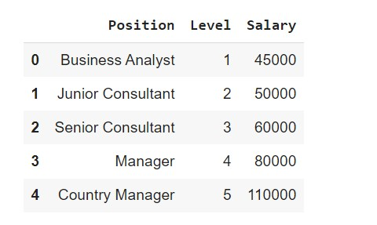
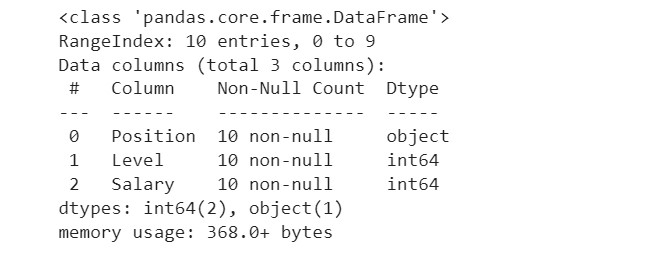
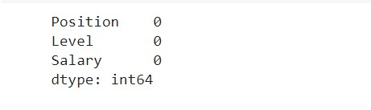
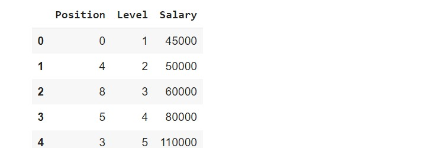
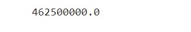
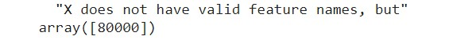

# Implementation-of-Decision-Tree-Regressor-Model-for-Predicting-the-Salary-of-the-Employee

## AIM:
To write a program to implement the Decision Tree Regressor Model for Predicting the Salary of the Employee.

## Equipments Required:
1. Hardware – PCs
2. Anaconda – Python 3.7 Installation / Moodle-Code Runner

## Algorithm
1.Import the required libraries.
2.Upload and read the dataset.
3.Check for any null values using the isnull() function.
4.From sklearn.tree import DecisionTreeClassifier and use criterion as entropy.
5.Find the accuracy of the model and predict the required values by importing the
required module from sklearn.
## Program:
```
/*
Program to implement the Decision Tree Classifier Model for Predicting Employee Churn.
Developed by: RAJESHKANNAN.M
RegisterNumber:  212221230081
*/
import pandas as pd
d=pd.read_csv("/content/Salary.csv")
d.head()
d.info()
d.isnull().sum()
d["left"].value_counts()
from sklearn.preprocessing import LabelEncoder
l=LabelEncoder()
d["salary"]=l.fit_transform(d["salary"])
d.head()
x=d[["satisfaction_level","last_evaluation","number_project","average_montly_hours","time_spend_company","Work_accident","promotion_last_5years","salary"]]
x.head()
y=d["left"]
from sklearn.model_selection import train_test_split
x_train,x_test,y_train,y_test=train_test_split(x,y,test_size=0.2,random_state=100)
from sklearn.tree import DecisionTreeClassifier
dt=DecisionTreeClassifier(criterion="entropy")
dt.fit(x_train,y_train)
y_pred=dt.predict(x_test)
from sklearn import metrics
acc=metrics.accuracy_score(y_test,y_pred)
acc
dt.predict([[.5,.8,9,260,6,0,1,2]])
```

## Output:
# Data Head

# Data Info

# Null Dataset

# Data head after Label Encorder

#  MSE

# x.head()



## Result:
Thus the program to implement the Decision Tree Regressor Model for Predicting the Salary of the Employee is written and verified using python programming.
